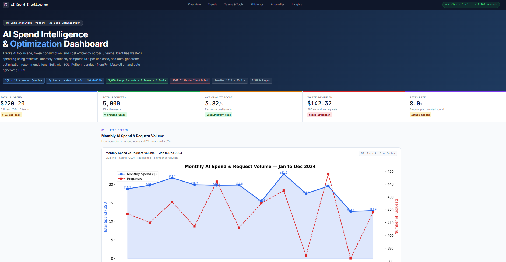

# 🤖 AI Spend Intelligence & Optimization Dashboard

## 🚀 End-to-End Data Analytics Project | SQL + Python + Dashboarding  

💰 Identified $142+ in cost inefficiencies and enabled data-driven optimization across 8 teams.
---

## 🎯 Problem Statement

Organizations increasingly rely on AI tools such as ChatGPT, GitHub Copilot, and Claude to enhance productivity and automate workflows. However, with the rapid growth of AI adoption, organizations face a critical challenge: lack of visibility and control over AI usage and associated costs.
Currently, there is no centralized system to effectively monitor how AI tools are utilized across teams, resulting in limited transparency and suboptimal decision-making.

As a result, organizations struggle to:
- Identify which users, teams, or departments drive highest usage and cost  
- Track token-level consumption (input, output, total tokens)  
- Detect redundant, low-value, or expensive AI requests  
- Measure ROI from AI usage  
- Compare cost-effectiveness across tools and models  
- Establish governance and cost control mechanisms  
**This project builds a full analytics pipeline that answers all these questions.**

---

## 📊 Live Dashboard

Interactive dashboard showcasing AI usage, cost trends, anomaly detection, and team-level insights.

🔗 **[View Live Dashboard →](https://jyothirmayiL-insights.github.io/AI-Spend-Intelligence-Optimization/)**
      

---

## 💡 Objective

The objective of this project is to build a centralized AI Spend Intelligence system that enables organizations to monitor AI usage, track token-level costs, detect inefficiencies, and optimize overall AI spending.
The solution focuses on delivering actionable insights that help improve cost efficiency, resource utilization, and return on investment (ROI) from AI tools.

---

## 💡 Why HTML Instead of Power BI?

While Power BI is widely used for dashboarding, this project leverages HTML to demonstrate greater flexibility, automation, and integration with Python-based data pipelines.

The dashboard is designed following Power BI principles such as KPI-driven reporting, structured analytical flow, and business-oriented visualization.

HTML enables automated report generation, seamless integration with data processing scripts, and efficient deployment via GitHub Pages.

*Note:* The data model, transformations, and insights are fully transferable to Power BI using DAX and standard visualization components.

---

## 🔑 Key Insights

- Identified **$142+ in cost inefficiencies** due to non-optimal usage  
- Detected anomalous high-cost requests using Z-score and IQR methods  
- Observed retry behavior increasing token consumption and cost overhead  
- Found cost concentration among a small group of users  
- Identified opportunities for cost optimization through better usage patterns  

---

## 💡 Recommendations

- Implement token-level monitoring for cost tracking  
- Introduce budget controls and usage alerts  
- Optimize prompts to reduce retries and token usage  
- Use cost-efficient AI models  
- Establish governance policies for AI usage  

---

## 🔄 Data Flow
Python → CSV/Excel → SQLite → SQL Analysis → Python Processing → Visualization → HTML Dashboard

---

## ⚙️ Key Features

- End-to-end analytics pipeline (data → SQL → Python → dashboard)  
- Automated anomaly detection (Z-score, IQR)  
- SQL-based cost and usage analysis  
- Auto-generated HTML dashboard  
- Multi-source data integration

---

## 🛠️ Tech Stack

| **Layer**           | **Tools / Technologies** | **Purpose**                                            |
| ------------------- | ------------------------ | ------------------------------------------------------ |
| **Data Generation** | Python                   | Synthetic dataset creation                             |
| **Data Storage**    | SQLite, Excel            | Structured data storage and management                 |
| **Data Querying**   | SQL                      | Data extraction and business analysis                  |
| **Data Processing** | Python (Pandas, NumPy)   | Data cleaning, transformation, and anomaly detection   |
| **Visualization**   | Matplotlib               | Data visualization and chart generation                |
| **Dashboarding**    | Python, HTML             | Automated reporting and interactive dashboard creation |

---

## 📁 Project Structure

```
ai-spend-intelligence/
│
├── data/
│   ├── ai_usage_logs.csv      ← main table (5,000 rows)
│   ├── users.csv              ← employee directory
│   ├── teams.csv              ← team reference
│   ├── tools.csv              ← AI tools and pricing
│   ├── budgets.csv            ← monthly budgets
│   ├── ai_spend_data.xlsx     ← all tables in one Excel file
│   └── ai_spend.db            ← SQLite database
│
├── sql/
│   └── queries.sql            ← all 15 SQL queries with comments
│
├── python/
│   ├── 01_generate_data.py    ← creates the dataset
│   ├── 02_analysis.py         ← SQL + Python analysis + charts
│   └── 03_generate_dashboard.py ← auto-generates HTML dashboard
│
├── charts/                    ← 6 PNG charts from Matplotlib
│
├── outputs/                   ← CSV result files from SQL queries
│
├── dashboard/
│   └── index.html             ← auto-generated HTML dashboard
│
├── insights/
│   └── business_insights.md  ← key findings + recommendations
│
└── README.md
```

---

## 🚀 How to Run

```bash
# 1. Clone
git clone https://github.com/YOUR-USERNAME/ai-spend-intelligence.git
cd ai-spend-intelligence

# 2. Install libraries
pip install pandas numpy matplotlib openpyxl

# 3. Generate the dataset
python python/01_generate_data.py

# 4. Run analysis (builds DB, runs SQL, creates charts)
python python/02_analysis.py

# 5. Generate the dashboard
python python/03_generate_dashboard.py

# 6. Open dashboard
open dashboard/index.html
```

---

## 📋 SQL Queries (15 Total)

| # | Business Question | SQL Concept |
|---|-------------------|-------------|
| Q1 | Executive KPI summary | SUM, AVG, COUNT |
| Q2 | Which team spends the most? | GROUP BY, ORDER BY |
| Q3 | Which tool costs the most? | Multi-metric aggregation |
| Q4 | How is spend trending monthly? | Time-series grouping |
| Q5 | Which use case has best ROI? | Derived column (quality÷cost) |
| Q6 | Top 15 highest spending users | Ranked aggregation + LIMIT |
| Q7 | Which requests are anomalously expensive? | **CTE + JOIN** |
| Q8 | Are teams within budget? | **CTE + LEFT JOIN + CASE WHEN** |
| Q9 | Which teams waste money on retries? | Conditional aggregation |
| Q10 | What time of day is AI used most? | GROUP BY numeric column |
| Q11 | Which team uses which tool? | Multi-column GROUP BY |
| Q12 | Rank teams by spend | **RANK() OVER window function** |
| Q13 | Month-over-month growth | **LAG() window function** |
| Q14 | Top tool per team | **RANK() OVER PARTITION BY** |
| Q15 | Auto-generate recommendations | **CTE + complex CASE WHEN** |

---

## 🧠 Skills Demonstrated

- ✅ End-to-end data pipeline: generate → clean → SQL → Python → dashboard
- ✅ SQL database design (5-table relational schema with foreign keys)
- ✅ 15 SQL queries — CTEs, window functions (LAG, RANK, PARTITION BY)
- ✅ Python data cleaning with pandas
- ✅ Statistical anomaly detection with NumPy (Z-Score + IQR)
- ✅ 6 data visualizations with Matplotlib
- ✅ Auto-generated HTML dashboard (Python writes the HTML)
- ✅ Excel workbook with 5 sheets
- ✅ Business insight generation from data

---

## 🌍 Business Value

- Gain visibility into AI usage and token-level costs  
- Identify wasteful spending and inefficiencies  
- Optimize AI tool usage and cost distribution  
- Improve decision-making using data insights  
- Maximize ROI from AI investments  

---

## 🏁 Project Summary

Built an end-to-end AI Spend Intelligence solution leveraging SQL and Python to analyze 5,000+ usage records across 8 teams, uncover cost inefficiencies, detect anomalies, and enable data-driven optimization of AI spending.

---
*Synthetic dataset simulating realistic AI tool usage in a 200-person technology company.*  
*Pricing based on approximate real-world API rates as of 2024.*
